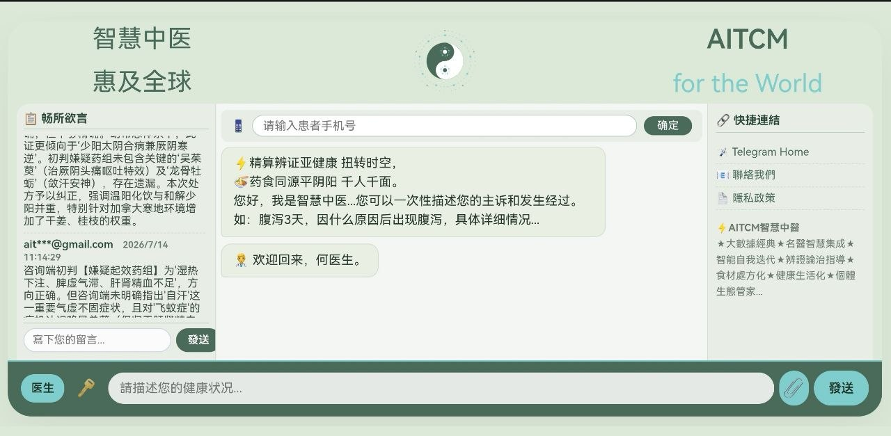

# 🍃 AITCM · 智慧中醫 惠及全球

> AITCM（Artificial Intelligence Traditional Chinese Medicine）— 基於大數據與名醫智慧的 AI 中醫辨證論治系統。

[](LICENSE)

---

## 📋 專案說明

本 Repo 為 AITCM 系統的 **全球公開版前端**，任何人都可以：

- ✅ 直接訪問 [https://aitcm.cpolar.io](https://aitcm.cpolar.io) 使用
- ✅ Fork 後修改前端樣式或品牌名稱
- ✅ 部署自己的版本

> ⚠️ 本 Repo **僅包含前端原始碼**

---

## 📸 畫面展示



*AITCM 智慧中醫 - AI 辨證對話、留言交流、快捷連結完整界面*（HTML + CSS + JavaScript），後端服務未公開。

---

## 🚀 快速開始

### 直接使用

無需安裝任何東西，打開瀏覽器即可：

```
https://aitcm.cpolar.io
```

### 自行部署

1. **Fork 本 Repo**
2. 修改 `index_public.html` 開頭的 `API_BASE` 指向你自己的後端伺服器
3. 部署到你的網頁伺服器（GitHub Pages、Vercel、Nginx 等皆可）

---

## 🛠️ 功能與特色

### ⚡️ AITCM 智慧中醫

> **大數據經典 × 名醫智慧集成**

- 🗣️ **AI 中醫辨證對話** — 模擬真實場景循環對話，舌診並辨證施治
- 📝 **留言交流** — 匿名留言交流心得，體驗後端辨證精髓
- 🧠 **具有自我學習能力** — 自我學習，快速迭代
- 📚 **名醫集成** — 近現代名醫經典案例匯集
- 🥗 **食材處方化** — 依辨證施治提供藥食同源膳食處方及調理建議
- 🩺 **醫師智慧助手** — 提供完整辨證施治、處方、理療臨床參考學習交流
- 🌐 **中英雙語支援** — 介面完整支援中英文切換
- 📱 **全面移動端適配** — 手機、平板、桌面皆可流暢使用

---

## 🎨 客製化設定

`index_public.html` 開頭有可自訂設定區，修改以下變數即可：

```js
const CUSTOM = {
    BRAND_CN: '智慧中医',
    BRAND_EN: 'AITCM',
    BRAND_TAGLINE: 'for the World',
    BRAND_SUBTITLE: '惠及全球',
    LOGO_COLOR_PRIMARY: '#4A6B5A',
    LOGO_COLOR_ACCENT: '#7FCDCD',
    WELCOME_MESSAGE: '您好，我是智慧中醫...'
};
```

---

## 📄 免責聲明

使用本系統前，請務必閱讀並同意 [免責聲明](https://aitcm.cpolar.io/disclaimer_public.html)。

---

## 🧑‍💻 作者與授權

- **品牌**：AITCM
- **授權**：MIT License

---

## 🌟 貢獻

歡迎 Issue 與 Pull Request！如有任何問題，請透過 [Telegram](https://t.me/aitcm_com) 聯絡。

---

## ☕ 支持我們

如果 AITCM 對您有幫助，歡迎請我們喝杯咖啡 ☕

**USDT (TRC-20)：**
```
TPDqSKBip7JGvnupDZpDRe2oykjY8SqvNy
```
